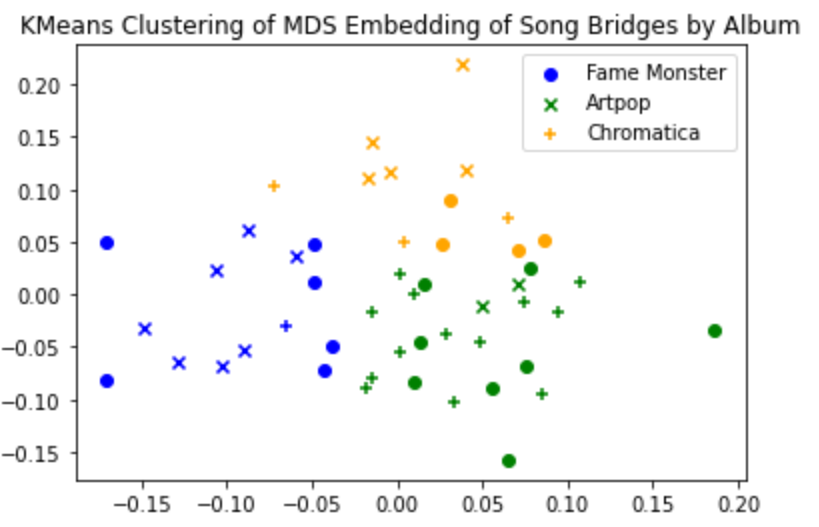
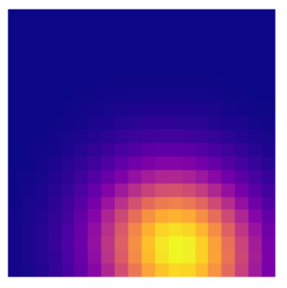
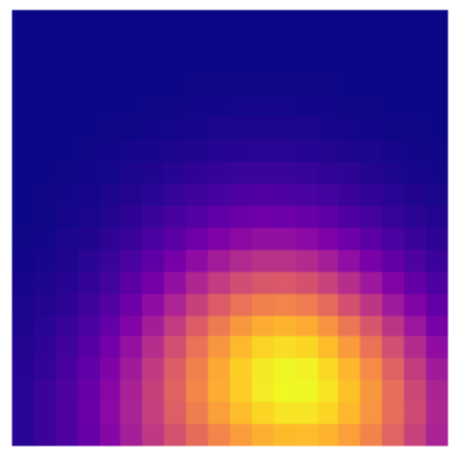
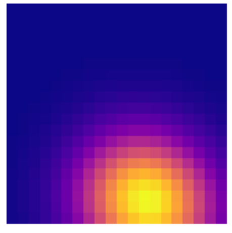
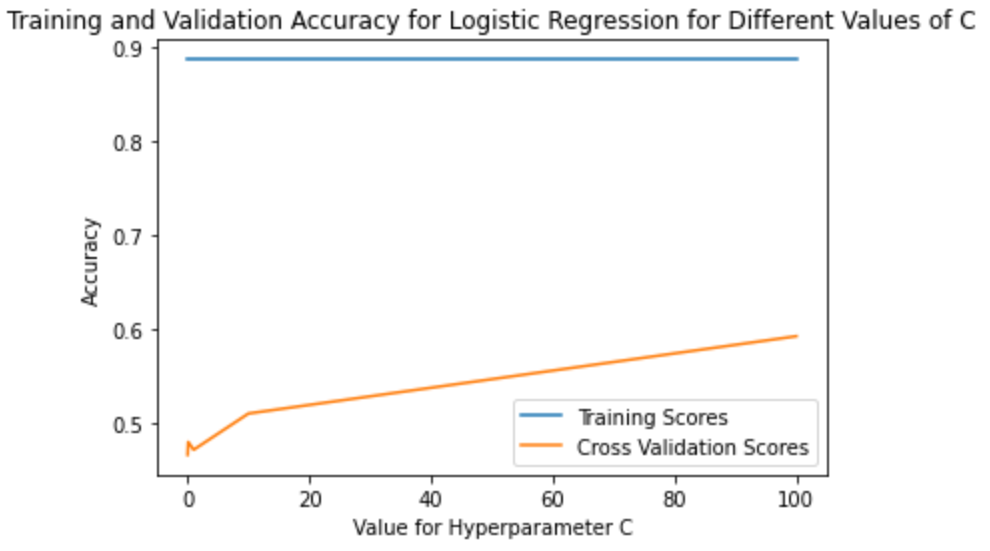
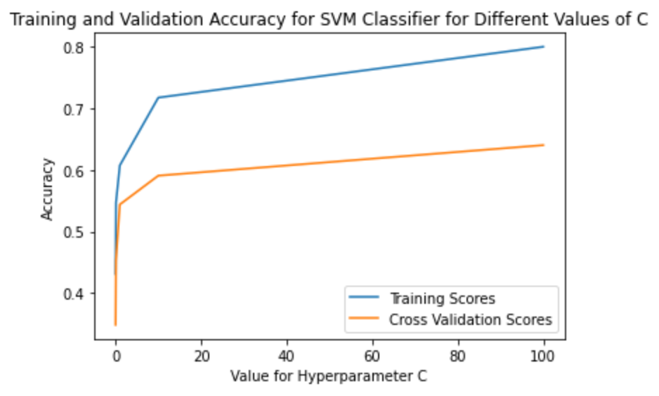

# Exploring Shape Features in Lady Gaga's Music

1D Persistent Homology of Waveform Music Data with Sliding Window Embedding

## Technologies Used

Python (sklearn, numpy, persim), Jupyter Notebook

## Description

Lady Gaga is one of the world’s best-selling music artists, and is particularly known for her consistent image reinventions. One natural question one might ask is whether there are noticeable differences in the “shape" of her music across her different albums, especially those of ostensibly similar genres. In order to answer this question, our team sought to apply methods in topological data analysis (TDA) to the waveforms of songs from three different albums (The Fame Monster, Artpop, Chromatica) spanning the length of her career. The goal was to extract topological features with which to perform a 3-class classification task on the songs from these albums, and then to interpret the results of this classification in relation to human-identifiable audio differences in the actual albums.

## Methods

We obtained MP3 files for all songs from the albums (not shared here due to copyright issues) and converted these to time-series data. We then manually segmented these songs into identifiable parts (verse, chorus, bridge) and all subsequent analysis was performed on these segments of songs. We transformed our waveforms to obtain something called the audio novelty function, which primarily captures percussive events in music. Following, we performed a sliding window embedding on these audio novelty functions in order to attempt to capture some features of periodicity in this data, and computed persistence diagrams based on this embedding. After computing the diagrams, we took two different approaches to classify persistence diagrams as corresponding to particular albums.

First, we conducted an exploratory visualization task, and attempted to perform k-means clustering on an embedding of the persistence diagrams corresponding to segments of songs. In particular, we computed pairwise bottleneck distances between persistence diagrams corresponding to segments of songs, and used the resulting distance matrix as input to a multidimensional scaling (MDS) embedding into 2 dimensions. Following, we ran a k-means clustering algorithm with 3 clusters on the embedded points.

Second, we completed a more traditional classification task using the persistence diagrams. We generated the 20-by-20 persistence images from the already-computed diagrams and vectorized these images to use as input to other machine learning methods (logistic regression, SVM with one-versus-rest) for multiclass classification. In particular, we split the data 60-40 for a train-test split then within the training set, tuned the hyperparameters for the models using 5-fold cross validation.

## Results

The MDS embedding followed by k-means clustering did not reveal an obvious structure relating to the distances between persistence diagrams. An example of one such visualization is shown below.

The colors correspond to the clusters found by k-means, while the true labels are signified by marker type.

The classification task was somewhat more successful. Qualitatively, the persistence images corresponding to songs from different albums did not appear significantly different - below are images for Dance in the Dark, Jewels N Drugs, and Free Woman.

The logistic regression model consistently overfit, as indicated by extremely high training accuracies. The SVM model did much better, with 10 an optimal value for the regularization parameter C. The training curves for both are displayed below.

Finally, evaluating this best SVM model on the test set, we achieved an accuracy of 0.62, which is significantly better than simply guessing the label of the most numerous class, which would be 0.43 in this case. At the same time, however, we have a relatively small data set, and the accuracy is still not particularly high.

## Authors and Acknowledgment

This project was developed by Selen Berkman, Joey Li, and Nathan Luksik as part of the coursework for the Fall 2020 session of Math 412: Topological Data Analysis at Duke University, taught by Professor John Harer. The team benefitted heavily from the feedback and instruction of Professor Harer throughout the process.

Additionally, we benefitted heavily from the work of Chris Tralie, particularly his pedagogical Jupyter notebooks located at https://github.com/ctralie/TDALabs. The use of the audio novelty function, as well as much of our base code, was borrowed from his work.

## Project Status

This project is currently not being updated. Some potential next steps include computing persistence landscapes from our diagrams in order to compute summary statistics (means and variances) for each album, as well as extending this work to Lady Gaga's other three albums not included in this preliminary study.
